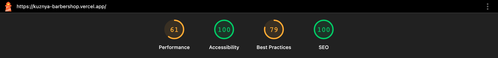

# Кузня — лендинг барбершопа

**Демонстрационный проект.** Компания «Кузня», мастера, цены и отзывы вымышлены.
Лендинг сделан как портфолио-работа, а не по заказу реального бизнеса.

Живой деплой: _добавить ссылку после деплоя на Vercel_



## Что здесь на самом деле продаётся

Не барбершоп. Мужчина, выбирающий новое место для стрижки, боится ровно одного:
выйти с головой, которую придётся две недели прятать. Всё остальное — цена,
интерьер, кофе — вторично.

Отсюда порядок секций, отличный от типового ТЗ: **работы мастеров** стоят выше
«почему мы», а блок преимуществ с иконками заменён на **строку из трёх фактов**
(«10 лет», «без записи по будням до 12:00», «детская с 3 лет»). Иконка ножниц с
подписью «качество» не убеждает никого. Лицо мастера с подписью «12 лет,
специализация — фейд» убеждает.

Галерея фильтруется по мастеру — это двадцать строк кода, которые дают связку
«работа → мастер → запись именно к нему».

## Технические решения и почему именно так

### Заявка доезжает до человека

Заявка уходит в Telegram администратору за секунду. Это то, что отличает
работающий лендинг от вёрстки.

```
Клиент → POST /api/lead → Zod → honeypot + time-trap → rate limit → идемпотентность
       → sendMessage в Telegram → 200 OK
                              ↘ ошибка → запись в Supabase → 200 OK (заявка не потеряна)
                                       ↘ обе упали → 503 + «позвоните нам»
```

**Почему резервная запись в Supabase.** Vercel-функции ходят к Telegram из
дата-центров, где доступ обычно есть, но гарантий нет. Если Telegram отказал,
заявка пишется в базу, а пользователь всё равно видит экран успеха: он не должен
расплачиваться за наш недоступный мессенджер. Если упали оба канала — честный
`503` с телефоном, а не «Error 500».

**Почему одна Zod-схема на клиент и сервер.** Клиентская проверка — это UX, а не
защита: запрос в `/api/lead` может прийти откуда угодно. Схема живёт в
`lib/schemas/lead.ts` и импортируется формой и Route Handler'ом.

**Почему honeypot проходит валидацию.** Заполненное скрытое поле не роняет схему
с `400`, а помечает запрос ботом через `looksLikeBot()`. Бот получает `200 OK` и
уходит довольным. Узнав про `400`, он подобрал бы обход.

**Почему `AbortSignal.timeout(5000)`.** Без таймаута зависший запрос к Telegram
держит функцию до лимита Vercel, а пользователь смотрит на спиннер.

**Почему `escapeMd()`.** `parse_mode: MarkdownV2` требует экранирования служебных
символов (`_ * [ ] ( ) ~ > # + - = | { } . !`, обратная кавычка и слэш) в _любом_
тексте, включая пользовательский. Имя «Пётр-Иван» роняет запрос с `400`, если дефис
не экранирован. Функция вынесена в модуль без `server-only` — чтобы её можно было
покрыть юнит-тестом.

### Идемпотентность

Пользователь жмёт кнопку дважды, потому что не понял, что первый клик сработал.
Двух защит по отдельности мало:

- **на клиенте** — защёлка в `ref`, а не только `disabled`: атрибут появляется
  после ререндера, а два клика мыши успевают пройти раньше;
- **на сервере** — ключ по хешу `(телефон, услуга, минута)`. Если заявка не доехала
  никуда, ключ отпускается: повтор должен пройти.

### Токен бота недоступен из браузера

`lib/env.ts` валидирует переменные Zod-схемой при импорте — приложение падает на
билде, а не в рантайме на проде. Файлы, читающие секреты, помечены
`import "server-only"`: случайный импорт из клиентского компонента сломает сборку,
а не утечёт в бандл. Проверяемо:

```bash
pnpm build && grep -r "$(grep TELEGRAM_BOT_TOKEN .env.local | cut -d= -f2- | tr -d '"')" .next/static || echo "чисто"
```

### Zustand здесь не нужен

Предзаполнение услуги и мастера из карточек — это ровно один `useState`,
поднятый в контекст над секциями. Тянуть стор ради него значит показать, что не
умеешь без стора. Zustand появится в следующем проекте, где оправдан.

`BookingProvider` — клиентский компонент, но секции приходят в него пропом
`children`, поэтому `Reviews` остаётся серверным.

### Карта грузится по клику

Iframe Яндекс.Карт весит больше, чем весь остальной лендинг. Заглушка — не
скриншот карты, а чертёжная сетка на inline-SVG: ноль байт и ноль запросов.
Iframe монтируется по клику. Это и честно по отношению к пользователю: карта
грузится, когда она нужна.

Проверяется в e2e: до клика — ни одного запроса к `yandex.ru`.

### Своя маска телефона вместо библиотеки

Библиотечные маски ломают вставку из буфера и `autofill`. Пятнадцать строк
(`lib/phone.ts`) ведут себя предсказуемо: `8 (999) 123-45-67` из буфера даёт
`+79991234567`, а backspace по разделителю удаляет цифру перед ним, а не топчется
на месте.

Поле собрано через `Controller`, не `register`: `onBlur` из `register`
перечитывает значение прямо из DOM и затирает нормализованное отформатированным.
В состоянии формы номер лежит как `+79991234567` — его же видит Zod и получает
сервер; человеку показывается `+7 (999) 123-45-67`.

### Доступность — не «сделаем потом»

- Ошибки формы связаны с полем через `aria-describedby`, поле помечено `aria-invalid`.
- Лайтбокс: `aria-modal`, ловушка фокуса, закрытие по `Esc` и клику по фону,
  возврат фокуса на карточку, с которой открывали, блокировка скролла с
  компенсацией ширины скроллбара.
- Видимый `:focus-visible` везде. Ни одного `outline: none`.
- При `prefers-reduced-motion: reduce` анимации не отключаются, а **схлопываются
  в мгновенную смену состояния**. Отключить их целиком значит оставить контент
  невидимым: стартовое состояние появления — `opacity: 0`.

Медиа-запрос читается своим хуком (`lib/reduced-motion.ts`), а не хуком из motion:
тот опрашивает настройку один раз при первом рендере и не реагирует на её смену.

### Производительность

Lighthouse на продовом билде, мобильный профиль, троттлинг:
**Performance 93 · Accessibility 100 · Best Practices 100 · SEO 100**.

Два вывода, которые стоили баллов:

- **Четыре начертания шрифта вместо двух — минус десять баллов Performance.**
  Oswald 700 и Golos 500 не встречались в вёрстке ни разу, но грузились в
  критическом пути. LCP упал с 3.9 с до 2.4 с.
- **Отсутствующий favicon — минус четыре балла Best Practices**: `404` в консоли.

Шрифты — через `next/font/google` с явным `subsets: ["cyrillic", "latin"]`, иначе
браузер тянет кириллицу и латиницу отдельными файлами. Все изображения — `next/image`,
`priority` только на LCP-картинке героя. CLS — 0.

### Дизайн: мастерская, а не «винтажный джентльмен»

Стандартный барбершоп-лендинг — чёрный фон, золотые вензеля, шрифт с засечками,
сепия, иконки ножниц и усов. Здесь иначе:

- не золото, а **латунь** — приглушённая, почти охра: золото блестит, латунь работает;
- не вензеля, а **сетка и линии** как на чертеже, рамки в 1px;
- не сепия, а **холодный контрастный свет**: все четырнадцать фотографий приведены
  к одной цветовой температуре, иначе галерея разваливается;
- не курсив с завитками, а **узкий гротеск капслоком**;
- никаких иконок ножниц и усов. Совсем.

Тени не используются нигде: на угольном фоне тень не видна, глубину даёт граница и
чуть более светлая поверхность. Скругления — максимум 4px.

**Латунь — только для действия.** На первом экране она встречается ровно один раз:
на кнопке «Записаться». Пока герой на экране, кнопка в шапке остаётся `ghost`;
стоит герою уехать — она забирает акцент себе.

## Стек

Next.js 16 (App Router) · TypeScript `strict` + `noUncheckedIndexedAccess` ·
Tailwind CSS 4 · Motion · React Hook Form · Zod · Supabase · Telegram Bot API · Vercel

Библиотека компонентов не подключалась: `Button`, `Input`, `Select`, `Lightbox`
пишутся быстрее, чем настраивается чужая тема, и лучше показывают владение вёрсткой.

## Структура

```
src/
  app/
    api/lead/route.ts     # приём формы, server-only
    opengraph-image.tsx   # OG генерируется, а не рисуется в Figma
    sitemap.ts, robots.ts, privacy/
  components/
    sections/             # по одной на секцию лендинга
    ui/                   # примитивы без бизнес-логики
    layout/, booking/
  lib/
    schemas/lead.ts       # одна схема на клиент и сервер
    phone.ts, dedupe.ts, telegram.ts, env.ts, analytics.ts
  content/                # тексты, услуги, мастера, отзывы — типизированные данные
```

**Контент лежит в `content/` как типизированные объекты**, а не хардкодится в JSX.
Секция получает данные пропсами. Это даёт две вещи бесплатно: контент можно вынести
в CMS без переписывания вёрстки, и данные отделены от представления. Связь
`works.masterSlug → masters.slug` проверяется типом, а не глазами.

## Тесты

- **Vitest** (32 теста) — Zod-схема (граничные телефоны, honeypot, согласие),
  нормализация телефона, ключ идемпотентности, экранирование MarkdownV2. Это те
  места, где ошибка не видна глазами.
- **Playwright** (8 сценариев) — заявка до экрана успеха, отказ канала, маска
  телефона посимвольно, `prefers-reduced-motion`, лайтбокс, фильтр галереи,
  отсутствие запросов к картам до клика. Прогон по **продовому** билду: dev-сервер
  отдаёт другой JS, и зелёный smoke на нём ничего не гарантирует.

CI гоняет `format:check → lint → typecheck → test → build` и e2e отдельным job'ом.

## Запуск

```bash
pnpm install
cp .env.example .env.local   # и заполнить
pnpm dev
```

Обязательны только `TELEGRAM_BOT_TOKEN` и `TELEGRAM_CHAT_ID`. Supabase и Upstash
опциональны: без них лендинг поднимается, теряя резервную запись лида и rate limit.

```bash
pnpm test       # юнит-тесты
pnpm test:e2e   # Playwright (сам поднимет продовый билд)
```

## Фотографии

Unsplash, лицензия допускает использование. Авторы — в [`CREDITS.md`](./CREDITS.md).
Шрифт Oswald для OG-картинки — SIL Open Font License.

Люди на фотографиях не имеют отношения к барбершопу «Кузня»: компания, мастера,
цены и отзывы вымышлены.
